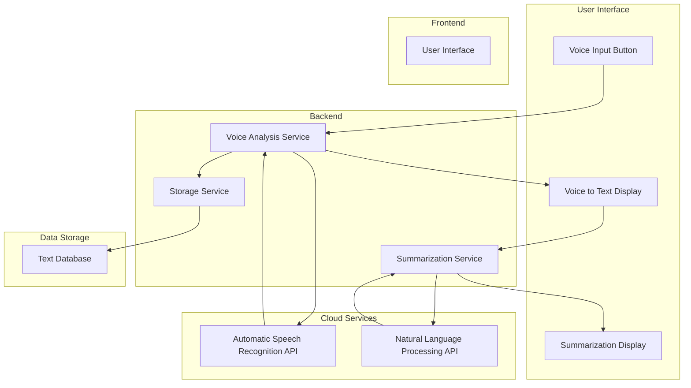

Certainly! Below is a markdown file with a Mermaid.js flowchart that outlines the high-level system architecture for the VoiceToText project. The architecture diagram shows the layers, technology choices, external integrations, and data storage components.

```markdown

```

### Explanation:
- **User Interface**: Represents the frontend components where the user interacts with the application.
  - **Voice Input Button**: For taking voice input.
  - **Voice to Text Display**: To show the converted text.
  - **Summarization Display**: To display the summarized text.

- **Frontend**: Contains the user interface elements.

- **Backend**: Handles the logic for processing voice input and text summarization.
  - **Voice Analysis Service**: Converts voice input to text using an ASR API.
  - **Summarization Service**: Summarizes the converted text using an NLP API.
  - **Storage Service**: Manages storing the converted text in a database.

- **Cloud Services**: External APIs used for specific tasks.
  - **Automatic Speech Recognition API**: Translates voice to text.
  - **Natural Language Processing API**: Provides text summarization functionality.

- **Data Storage**: 
  - **Text Database**: Stores the final converted and summarized text data.

This architecture provides a clear separation of concerns and leverages cloud services for complex tasks such as speech recognition and text summarization.