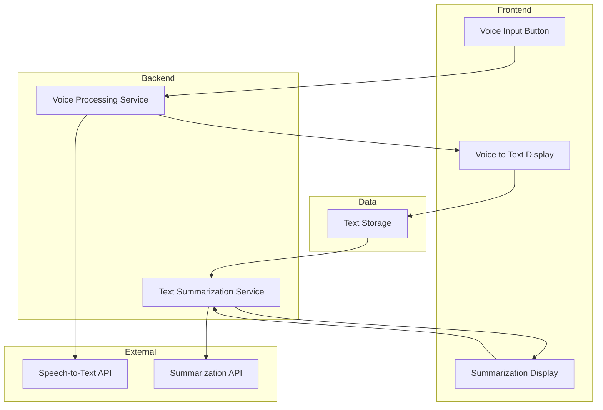

Below is a markdown file with a Mermaid.js flowchart TB diagram illustrating the architecture for the "VoiceToText" project. The components are organized by layer: Frontend, Backend, Data, and External, with arrows indicating the dependencies between them.

```markdown

```

This diagram represents the following components and interactions:

- **Frontend Layer**:
  - **Voice Input Button (A)**: Allows users to input voice.
  - **Voice to Text Display (B)**: Displays the converted text from the voice input.
  - **Summarization Display (C)**: Displays the summarized bullet points of the text.

- **Backend Layer**:
  - **Voice Processing Service (D)**: Processes the voice input and converts it to text using the Speech-to-Text API.
  - **Text Summarization Service (E)**: Summarizes the text using the Summarization API.

- **Data Layer**:
  - **Text Storage (F)**: Stores the text for processing and summarization.

- **External Layer**:
  - **Speech-to-Text API (G)**: External service used by the Voice Processing Service to convert voice to text.
  - **Summarization API (H)**: External service used by the Text Summarization Service to summarize text.

Dependencies:
- The Voice Input Button sends voice data to the Voice Processing Service.
- The Voice Processing Service uses the Speech-to-Text API to convert voice to text and sends the result to the Voice to Text Display.
- Converted text is stored in Text Storage.
- Text Storage provides text to the Text Summarization Service for summarization.
- The Text Summarization Service uses the Summarization API to generate bullet points, sending the result to the Summarization Display.