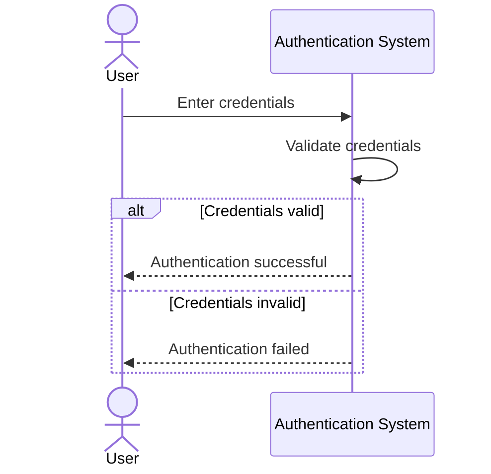
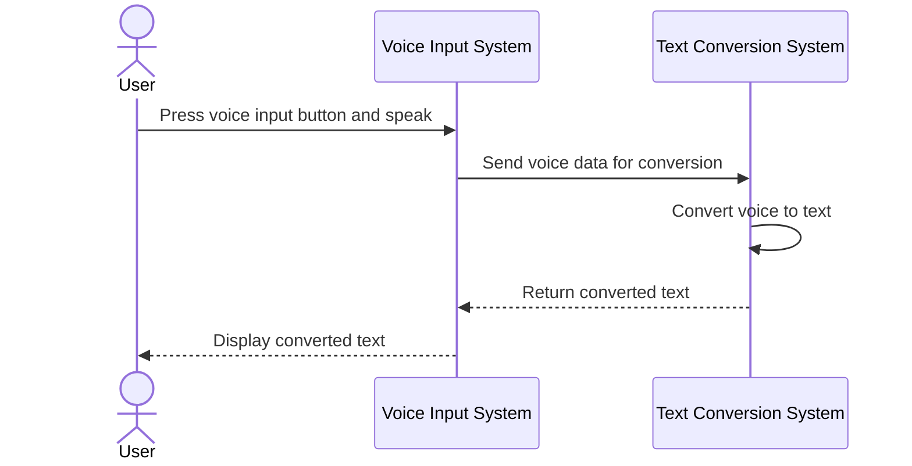
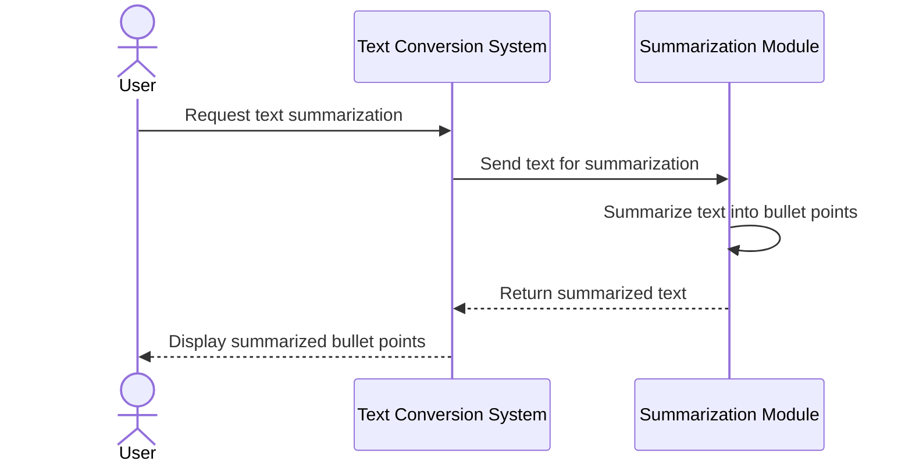

Below is a markdown file containing Mermaid.js sequence diagrams for the key user flows specified in the requirements for the VoiceToText project. The diagrams include authentication, voice-to-text conversion, and summarization.

```markdown
# VoiceToText Project Sequence Diagrams

## 1. User Authentication Flow



## 2. Voice Input and Conversion Flow



## 3. Text Summarization Flow


```

These diagrams illustrate the key interactions between the user, the system's components, and the data flow for the VoiceToText application's main features.