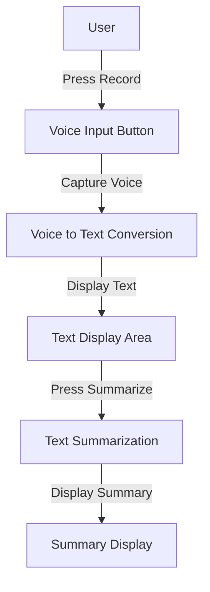
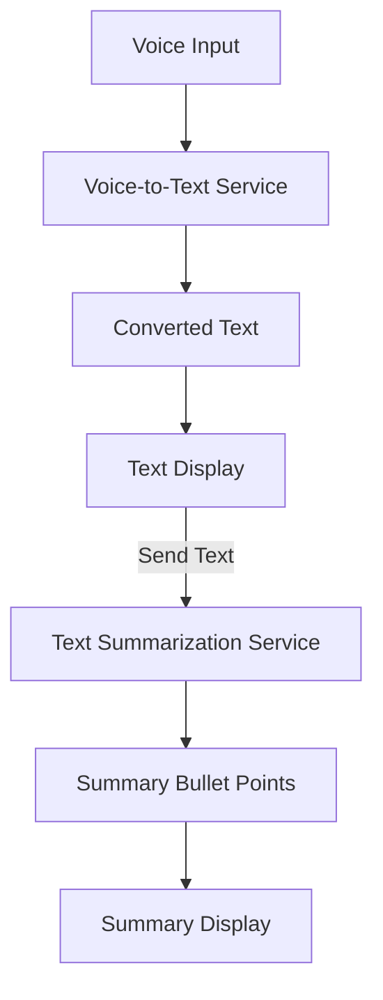

# VoiceToText System Flow Documentation

## 1. User Workflows

### Overview
The VoiceToText application allows users to convert spoken words into text and then summarize the converted text into bullet points. The user interface consists of three main sections: a button to capture voice input, a display area for the converted text, and a section for summarizing the text.

### User Journey
1. **Voice Input**
   - User presses the "Record" button to start capturing voice input.
   - User speaks into the microphone.
   - User presses the "Stop" button to end the recording.

2. **Voice to Text Conversion**
   - The recorded voice input is converted into text and displayed in the text area.

3. **Text Summarization**
   - The user clicks the "Summarize" button.
   - The system processes the text and displays a summary in bullet points.

## 2. Data Flows

### Overview
The data flow involves capturing voice input, converting it into text, summarizing the text, and displaying both the text and its summary.

### Detailed Flow
1. **Voice Capture**
   - Audio data is captured from the user's microphone.

2. **Conversion Process**
   - Audio data is sent to the Voice-to-Text conversion service.
   - Converted text is received from the service.

3. **Summarization Process**
   - Text data is sent to the Text Summarization service.
   - Summary bullet points are received from the service.

4. **Display**
   - Converted text and summary are displayed to the user.

## 3. Integration Points

### Components
1. **User Interface**
   - A web or mobile interface for user interactions.

2. **Voice-to-Text Service**
   - An API service (e.g., Google Cloud Speech-to-Text) for converting voice input to text.

3. **Text Summarization Service**
   - An API service (e.g., OpenAI's GPT-3 or a custom summarization algorithm) for summarizing text.

### Integration Flow
- The UI component interacts with both the Voice-to-Text and Text Summarization services to process data and update the display.

## 4. Error Handling

### Error Scenarios
1. **Voice Capture Failure**
   - Issue: Microphone access is denied or hardware failure.
   - Handling: Display an error message and prompt the user to check microphone settings.

2. **Conversion Failure**
   - Issue: Voice-to-Text service is unavailable or returns an error.
   - Handling: Retry the request after a brief delay and display an error message if the issue persists.

3. **Summarization Failure**
   - Issue: Text Summarization service is unavailable or returns an error.
   - Handling: Retry the request after a brief delay and display an error message if the issue persists.

4. **Network Issues**
   - Issue: Loss of internet connectivity.
   - Handling: Display a notification about connectivity issues and attempt to reconnect.

### Error Display
- All errors should be displayed in a user-friendly manner, with instructions for troubleshooting if necessary.